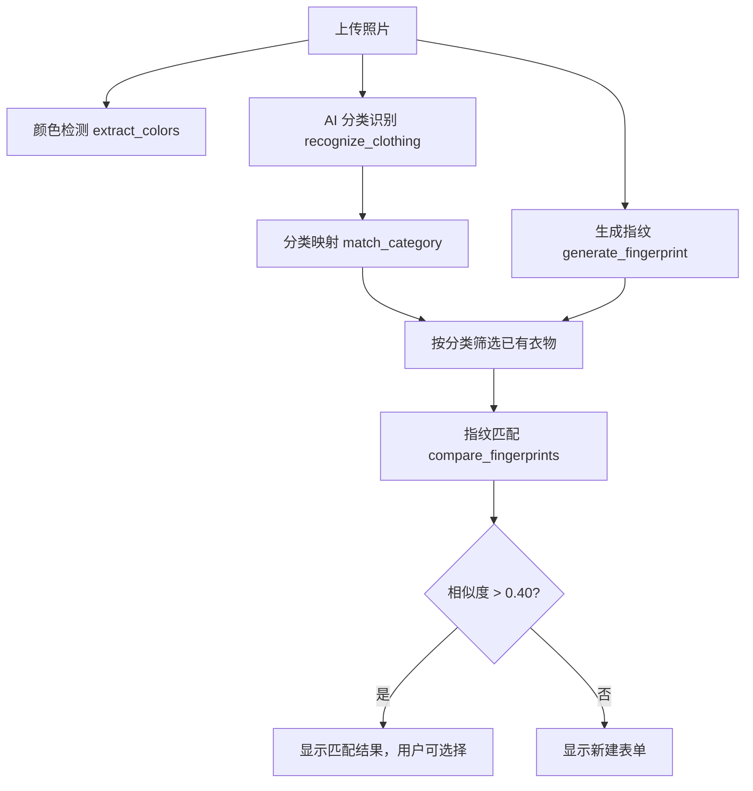

# Samantha的衣橱 v1.0.0 — 实现文档

> 技术栈：Python Flask + SQLAlchemy + SQLite + Tailwind CSS + 腾讯云 TIIA + Pillow  
> 部署方式：Docker Compose（清华 PyPI 镜像加速）  
> 入口文件：`app.py`（约 850 行）

---

## 目录

1. [数据模型](#1-数据模型)
2. [照片处理与缩略图](#2-照片处理与缩略图)
3. [HSV 颜色指纹（拍照找衣物）](#3-hsv-颜色指纹拍照找衣物)
4. [本地颜色检测](#4-本地颜色检测)
5. [腾讯云 AI 识别服装分类](#5-腾讯云-ai-识别服装分类)
6. [AI 分类映射到用户分类](#6-ai-分类映射到用户分类)
7. [智能录入（统一流程）](#7-智能录入统一流程)
8. [拍照找衣物](#8-拍照找衣物)
9. [首页统计与当前季节](#9-首页统计与当前季节)
10. [衣物 CRUD](#10-衣物-crud)
11. [品牌/颜色/位置预设自动保存](#11-品牌颜色位置预设自动保存)
12. [四级存储位置](#12-四级存储位置)
13. [数据导出](#13-数据导出)
14. [分类/品牌/颜色/位置预设管理](#14-分类品牌颜色位置预设管理)
15. [iPhone PWA 适配](#15-iphone-pwa-适配)
16. [Docker 部署](#16-docker-部署)

---

## 1. 数据模型

使用 SQLAlchemy ORM + SQLite，共 6 张表：

### 1.1 Category（分类）
```python
class Category(db.Model):
    id          = db.Column(db.Integer, primary_key=True)
    name        = db.Column(db.String(50), nullable=False)   # 上衣、裤子、裙子...
    icon        = db.Column(db.String(10), default='👔')      # Emoji 图标
    sort_order  = db.Column(db.Integer, default=0)            # 排序权重
    garments    = db.relationship('Garment', backref='category', lazy='dynamic')
```

### 1.2 Brand（品牌）
```python
class Brand(db.Model):
    id          = db.Column(db.Integer, primary_key=True)
    name        = db.Column(db.String(100), nullable=False)   # 优衣库、ZARA...
    sort_order  = db.Column(db.Integer, default=0)
    garments    = db.relationship('Garment', backref='brand_rel', lazy='dynamic')
```

### 1.3 ColorPreset（颜色预设）
```python
class ColorPreset(db.Model):
    id          = db.Column(db.Integer, primary_key=True)
    name        = db.Column(db.String(50), nullable=False)    # 黑色、白色、红色...
    sort_order  = db.Column(db.Integer, default=0)
```

### 1.4 LocationPreset（位置预设）
```python
class LocationPreset(db.Model):
    id          = db.Column(db.Integer, primary_key=True)
    name        = db.Column(db.String(200), nullable=False)   # 显示名称（完整路径）
    room        = db.Column(db.String(100))                   # 房间
    position    = db.Column(db.String(100))                   # 具体位置（柜子/收纳箱等）
    sort_order  = db.Column(db.Integer, default=0)
    garments    = db.relationship('Garment', backref='location_preset', lazy='dynamic')
```

### 1.5 Garment（衣物）—— 核心表
```python
class Garment(db.Model):
    id                  = db.Column(db.Integer, primary_key=True)
    name                = db.Column(db.String(200), nullable=False)
    category_id         = db.Column(db.Integer, db.ForeignKey('categories.id'))
    brand_id            = db.Column(db.Integer, db.ForeignKey('brands.id'))
    location_preset_id  = db.Column(db.Integer, db.ForeignKey('location_presets.id'))
    color               = db.Column(db.String(100))
    material            = db.Column(db.String(200))
    season_group        = db.Column(db.String(50))        # 夏季/冬季/春秋季
    status              = db.Column(db.String(20), default='在库')  # 在库/取出
    fingerprint         = db.Column(db.Text)              # HSV 指纹 JSON
    price               = db.Column(db.Float)
    purchase_date       = db.Column(db.Date)
    photo               = db.Column(db.String(500))
    thumbnail           = db.Column(db.String(500))
    notes               = db.Column(db.Text)
    archived            = db.Column(db.Boolean, default=False)
    size_label          = db.Column(db.String(50))
    shoulder/bust/waist/hip/length/sleeve = db.Column(db.Float)  # 尺寸(cm)
    custom_size         = db.Column(db.String(200))
    created_at/updated_at = db.Column(db.DateTime)
```

### 1.6 初始化
```python
def init_db():
    db.create_all()                              # 自动建表
    if Category.query.count() == 0:              # 首次启动插入默认数据
        for icon, name, order in DEFAULT_CATEGORIES:
            db.session.add(Category(...))
    if Brand.query.count() == 0:
        for name, order in DEFAULT_BRANDS:
            db.session.add(Brand(...))
```

---

## 2. 照片处理与缩略图

```python
def save_photo(file) -> tuple:
```
- 上传照片保存为时间戳命名（`YYYYMMDDHHmmssffffff.jpg`）
- Pillow 打开 → 转换 RGB → `thumbnail((400, 400), LANCZOS)` 缩放
- 缩略图保存为 WebP 格式（`thumb_xxx.webp`），质量 80
- 返回 `(原图文件名, 缩略图文件名)`

---

## 3. HSV 颜色指纹（拍照找衣物）

### 3.1 生成指纹 `generate_fingerprint(image_path)`

```
流程：
1. 打开图片 → RGB
2. 裁掉四周 20%（中心 60% × 60%），忽略背景干扰
3. 缩放到 80×80（6400 像素）
4. 每个像素：RGB → HSV
5. 量化到 128 维直方图：
   - H（色相）：0-360° → 8 个区间（每个 45°）
   - S（饱和度）：0-1 → 4 个区间
   - V（明度）：0-1 → 4 个区间
   - 索引 = H_idx × 16 + S_idx × 4 + V_idx
6. 归一化（除以总像素数）
7. 存储为 JSON：{"hist": [0.012, 0.008, ...], "version": 1}
```

### 3.2 比较指纹 `compare_fingerprints(fp1, fp2)`

使用**直方图交集**（Histogram Intersection）：

```
相似度 = Σ min(hist1[i], hist2[i])
```

返回值范围 0~1。实际测试中，相同衣物约 0.5-0.9，不同衣物约 0.1-0.3。

---

## 4. 本地颜色检测

```python
def extract_colors(image_path, top_n=1)
```

预定义 13 种颜色范围（RGB 上下界）：

| 颜色 | RGB 范围 |
|------|---------|
| 黑色 | (0,0,0) ~ (45,45,45) |
| 白色 | (200,200,200) ~ (255,255,255) |
| 红色 | (150,0,0) ~ (255,80,80) |
| 蓝色 | (0,0,120) ~ (80,100,255) |
| 粉色 | (200,120,150) ~ (255,180,210) |
| ... | ... |

```
流程：
1. 中心裁切（去掉 20% 边缘）→ 缩放到 120×120
2. 遍历所有像素，对每种颜色范围统计像素占比
3. 占比 > 10% 的颜色入选，按占比降序排列
4. 返回 top_n 个结果，每个包含 {name, hex, pct}
```

---

## 5. 腾讯云 AI 识别服装分类

```python
def recognize_clothing(image_path):
```

- 使用腾讯云图像识别（TIIA）的 `DetectProduct` API
- 从环境变量读取 `TENCENT_SECRET_ID` / `TENCENT_SECRET_KEY`
- 图片以 Base64 编码后发送
- 返回结果列表：`[{name, category, confidence}, ...]`

**依赖**：`tencentcloud-sdk-python==3.0.1353`

---

## 6. AI 分类映射到用户分类

```python
def match_category(ai_results, user_categories):
```

腾讯云返回的类别名（如 "上衣"、"T恤"）需要映射到用户自定义的分类。使用关键词匹配表：

```python
kmap = {
    cat_id: [cat_name, '别名1', '别名2', ...]
}
# 例如：
# 上衣 → ['上衣', 'T恤', '衬衫', '卫衣', '雪纺', 'top', 'shirt']
# 裤子 → ['裤子', '牛仔裤', '休闲裤', '短裤', 'pants', 'jeans']
# 裙子 → ['裙子', '连衣裙', '半身裙', 'dress', 'skirt']
# ...
```

匹配逻辑：遍历 AI 返回的产品名和分类名，与每个用户分类的关键词列表进行子串匹配，选择置信度最高的匹配结果。

---

## 7. 智能录入（统一流程）

```
路由：/garments/smart  (GET + POST)
      /api/smart-analyze  (POST, JSON API)
```

### 7.1 拍照分析流程（POST photo）



### 7.2 确认录入（POST from_smart=confirm）

用户确认后：
- 从临时文件重命名为正式文件名
- 生成缩略图
- 自动保存品牌到 Brand 表
- 自动保存颜色到 ColorPreset 表
- 跳转到衣物详情页

---

## 8. 拍照找衣物

```
路由：/find  (GET + POST)
```

与智能录入类似，但侧重点是**找到已有衣物的存放位置**：

1. 上传照片 → 生成指纹 + 颜色检测 + AI 分类
2. AI 分类映射后缩小候选范围（同分类衣物）
3. 对候选衣物逐一指纹匹配 + 颜色加分
4. 返回 top 10（相似度 > 30%），展示位置信息

---

## 9. 首页统计与当前季节

```python
@app.route('/')
def index():
```

- **总件数**：`Garment.query.filter_by(archived=False).count()`
- **取出数量**：`filter(Garment.status != '在库').count()`
- **当前季节**：根据当前月份自动判断
  - 5-9月 → 夏季
  - 12-2月 → 冬季
  - 其他 → 春秋季
- **季节统计**：按 `season_group` 分组统计
- **最近添加**：按 `created_at` 倒序取 8 件

---

## 10. 衣物 CRUD

### 10.1 新建衣物 `_save_garment(garment)`
- 支持下拉选择或**自由输入**分类、品牌（输入新名称自动创建预设）
- 照片上传自动生成指纹
- 价格、日期、尺寸等可选字段

### 10.2 克隆衣物
```python
@app.route('/garments/<int:id>/clone', methods=['POST'])
```
- 复制原衣物的所有属性
- 名称加 "(副本)" 后缀
- 跳转到编辑页

### 10.3 删除衣物
- POST 请求，确认后删除

### 10.4 状态切换
```python
@app.route('/garments/<int:id>/status', methods=['POST'])
```
- 切换 `status` 字段：在库 / 取出

---

## 11. 品牌/颜色/位置预设自动保存

在 `_save_garment()` 中，保存衣物的同时：

```python
# 品牌：新输入的文字 → 自动创建 Brand 记录
bname = request.form.get('brand_text', '').strip()
if bname:
    brand = Brand.query.filter_by(name=bname).first()
    if not brand:
        brand = Brand(name=bname, sort_order=max_order+1)
        db.session.add(brand)

# 颜色：自动创建 ColorPreset 记录
if garment.color and garment.color.strip():
    if not ColorPreset.query.filter_by(name=cn).first():
        db.session.add(ColorPreset(name=cn, sort_order=max_order+1))
```

这样用户使用过程中，品牌和颜色预设会自动积累，无需手动维护。

---

## 12. 四级存储位置

位置信息存储在 `LocationPreset` 表中：

```
主卧 → 左侧衣柜 → 上层 → 收纳箱A
 ↑         ↑        ↑        ↑
room     cabinet   shelf    box
```

- 位置名（name）由 ` → ` 连接各级组成
- 衣物通过 `location_preset_id` 外键关联
- 首页和详情页展示完整位置路径

---

## 13. 数据导出

```python
@app.route('/export')
def export_data():
```

- 生成 ZIP 包，包含：
  - `数据.json`：所有衣物数据（名称、分类、品牌、颜色、季节、位置等）
  - `照片/` 目录：原图 + 缩略图
- 文件名：`wardrobe_backup_YYYYmmdd.zip`
- 使用 `io.BytesIO` 内存流，不落盘

---

## 14. 分类/品牌/颜色/位置预设管理

四个管理页面结构一致：

```
/manage/categories  →  分类管理
/manage/brands      →  品牌管理
/manage/colors      →  颜色管理
/manage/locations   →  位置管理
```

每个页面支持：
- **添加**：POST `action=add`，自动计算 `sort_order`
- **编辑**：POST `action=edit`，通过 ID 更新
- **删除**：POST `action=delete`，删除前检查是否有衣物引用（有引用的不允许删除）

---

## 15. iPhone PWA 适配

### 15.1 Safe Area
```css
:root {
    --sat: env(safe-area-inset-top, 0px);
    --sab: env(safe-area-inset-bottom, 0px);
    --sar: env(safe-area-inset-right, 0px);
    --sal: env(safe-area-inset-left, 0px);
}
```
导航栏顶部预留刘海区域，底部预留 Home Indicator 区域。

### 15.2 FAB（浮动操作按钮）
```html
<a href="/garments/smart" class="fixed z-40 fab ...">📷</a>
```
右下角固定，底部安全距离 `calc(var(--sab) + 1.5rem)`。

### 15.3 PWA Manifest
`static/manifest.json` — 配置应用名、图标、启动方式。

### 15.4 Service Worker
`static/sw.js` — 基础离线缓存。

### 15.5 iOS 适配
```html
<meta name="apple-mobile-web-app-capable" content="yes">
<meta name="apple-mobile-web-app-status-bar-style" content="black-translucent">
<meta name="apple-mobile-web-app-title" content="Samantha">
```
- `user-scalable=no` 防止双击缩放
- `input { font-size: 16px !important }` 防止 iOS 自动缩放输入框

---

## 16. Docker 部署

### 16.1 Dockerfile
```dockerfile
FROM python:3.11-slim
WORKDIR /app
RUN pip install --no-cache-dir -i https://pypi.tuna.tsinghua.edu.cn/simple \
    flask==3.1.0 flask-sqlalchemy==3.1.1 sqlalchemy==2.0.36 \
    pillow==11.1.0 gunicorn==23.0.0 tencentcloud-sdk-python==3.0.1353
COPY . .
RUN mkdir -p /app/data/uploads
ENV DATA_PATH=/app/data
EXPOSE 3000
CMD ["sh", "-c", "python -c 'from app import app, init_db; app.app_context().push(); init_db()' && gunicorn --bind 0.0.0.0:3000 --workers 2 --timeout 120 app:app"]
```

### 16.2 docker-compose.yml
```yaml
services:
  wardrobe:
    build: .
    ports: ["3000:3000"]
    volumes: ["./data:/app/data"]    # 数据持久化
    env_file: [".env"]               # 密钥配置
    environment: [DATA_PATH=/app/data]
    restart: unless-stopped
```

### 16.3 环境变量（.env）
```
SECRET_KEY=随机字符串
TENCENT_SECRET_ID=腾讯云 SecretId
TENCENT_SECRET_KEY=腾讯云 SecretKey
```

### 16.4 启动
```bash
docker compose up -d --build
```

---

## 附录：路由总表

| 方法 | 路径 | 功能 |
|------|------|------|
| GET | `/` | 首页 |
| GET | `/garments` | 衣物列表（支持筛选） |
| GET/POST | `/garments/new` | 新建衣物 |
| GET/POST | `/garments/<id>/edit` | 编辑衣物 |
| GET | `/garments/<id>` | 衣物详情 |
| POST | `/garments/<id>/delete` | 删除衣物 |
| POST | `/garments/<id>/clone` | 克隆衣物 |
| POST | `/garments/<id>/status` | 切换状态 |
| GET/POST | `/garments/smart` | 智能录入 |
| POST | `/api/smart-analyze` | 智能分析 API |
| GET/POST | `/find` | 拍照找衣物 |
| GET | `/locations` | 按位置浏览 |
| GET | `/manage` | 管理首页 |
| GET/POST | `/manage/categories` | 分类管理 |
| GET/POST | `/manage/brands` | 品牌管理 |
| GET/POST | `/manage/colors` | 颜色管理 |
| GET/POST | `/manage/locations` | 位置管理 |
| GET | `/export` | 数据导出 |
| GET | `/uploads/<fn>` | 照片访问 |
| GET | `/manifest.json` | PWA Manifest |
| GET | `/sw.js` | Service Worker |
